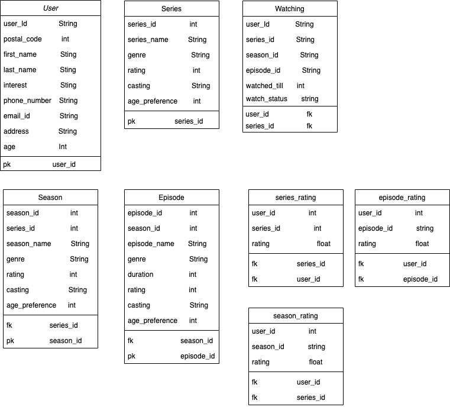
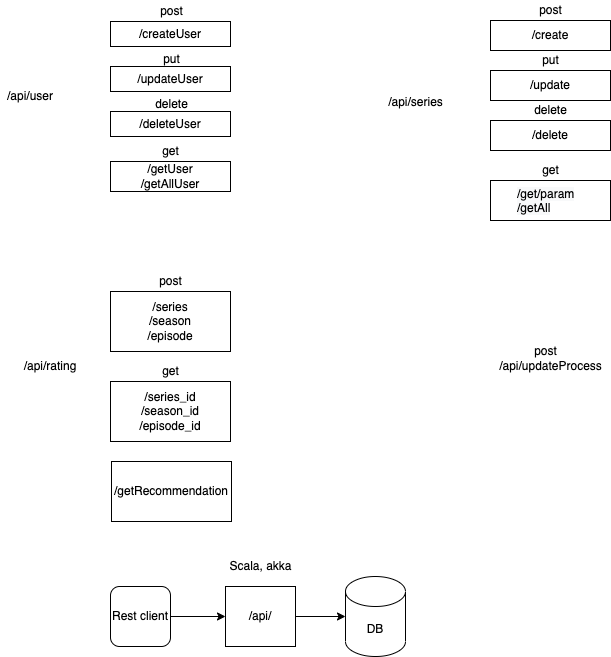

# Database Model

`Used In-memory H2 database to save the data with the following schema while starting the application it initilize the database if you want to get a fresh database please delete file named [tsms.db.mv.db] at root direcctory`



# System Architecture



## How to use the project

There are basically 4 major Services which provides 25 end points. A postman export file is provide with
name `TSMS_request.postman_collection.json`
Please use import it to get all the request predefined

Entry Point/ main method is in `src/main/scala/Boot.scala` 
Please Open the project in Intellij using build.sbt/project folder
and run Boot.scala

The server will start at `https://localhost:8080/`

The application is using `H2` In-memory database

# Services

### 1. Rating Service

Rating service is responsible for provide all the functionality related to ratings

#### Provided Endpoints:

```text
api/path("getSeriesRating")
Get EndPoint
Params: userId   type Int
        seriesId type Int

api/path("updateSeriesRating")
Post End Point
Request:
{
    "userId": 2,
    "seriesId": 2,
    "rating": 5
}

api/path("getSeasonRating")
Get End Point
Params: userId   type Int
        seasonId type Int
        
api/path("updateSeasonRating")
Post End Point
Request:
{
    "userId": 2,
    "seasonId": 2-season1,
    "rating": 5
}

api/path("getEpisodeRating")
Get End Point
Params: userId   type Int
        episodeId type Int
        
api/path("updateEpisodeRating")
Post EndPoint
Request:
{
    "userId": 2,
    "episodeId": 2-season1-episode1,
    "rating": 5
}

api/path("getSeriesRecommendation")
Get End Point
Params: userId   type Int
```

### 2. Series Service

```text
api/path("addSeries") 
Post End Point
Request:
{
    "seriesName": "Series12",
    "genre": "Comedy,Action",
    "rating": 4.0,
    "casting": "abc,def,ghi",
    "agePreference": 15
}

api/path("deleteSeries") 
Delete End Point
Param:
seriesId    type Int

api/path("getAllSeries") 
Get End Point
Param:
seriesId    type Int
this parameter is user for pagination

api/path("getSeries") 
Get End Point
Param:
seriesId    type Int

api/path("addSeason") 
Post End Point 
Request:
{
    "seriesId": 2,
    "seasonName": "season3",
    "genre": "Comedy",
    "rating": 4.3,
    "casting": "abc,def,ghi,jkl,mno,pqr",
    "agePreference": 14
}

api/path("deleteSeason") 
Delete End Point
Param:
seriesId    type Int
seasonName  type String

api/path("getSeasons") 
Get End Point
Param:
seriesId    type Int

api/path("addEpisode") 
Post End Point
Request:
{
    "seasonId": "2-season1",
    "episodeName": "episode5",
    "duration": 3600,
    "genre": "Comedy",
    "rating": 3.2,
    "casting": "abc,def,ghi,jkl,mno,pqr",
    "agePreference": 15
}

api/path("deleteEpisode") 
Delete End Point
Param:
seasonId    type String
episodeName type String

api/path("getEpisodes") 
Get End Point
Param:
seasonId    type String

api/path("getWatchStatus") 
Get End Point
Param:
userId  type String
episodeId   String

api/path("updateWatchStatus") 
Post End Point
Request:
{
    "userId": 4,
    "episodeId": "2-season1-episode4",
    "watchedTill": 3000,
    "status": "watching"
}
```
### 3. Spoiler Aler Service
```text
api/path("getSpoilerAlert")
Get End Point
Param:
userId1     type Int
userId2     type Int
episodeId   String
```

### 4. User Service
```text
api/path("getUsers") 
Get End Point
Param:

api/path("getUser") 
Get End Point
Param:
userId  type Int

api/path("addUser") 
Post End Point
Request:
{
    "address": "india",
    "age": 25,
    "emailId": "abc@xyz.com",
    "firstName": "onemoreuser2",
    "interest": "Comedy,Action",
    "lastName": "newlastname",
    "phoneNumber": "UUUUUUUUU",
    "postalCode": 122112
}

api/path("deleteUser") 
Delete End Point
Param:
userId  type    Int

api/path("updateUser")
Put End Point 
Request:
{
    "userId":1,
    "address": "updated_address",
    "age": 10,
    "emailId": "update@email.com",
    "firstName": "updated_first_name",
    "interest": "rom-com",
    "lastName": "updated_last_name_1",
    "phoneNumber": "XXXXXXXXXX",
    "postalCode": 123321
}
```
Note. Rating can't be greater than 5

postal code in user table is there, so we can use it for spoiler alert and if two user are in the same locality.

Recommendation is just base on the interest of the user and genre of the Series, it can be improved using series_rating table

The rating table has the rating per user

The ratings in series, season and episode Tables are the average ratings given by all the users for specific series, season and episode.